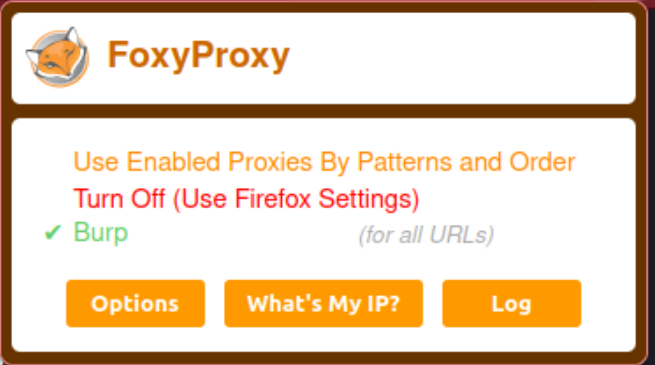
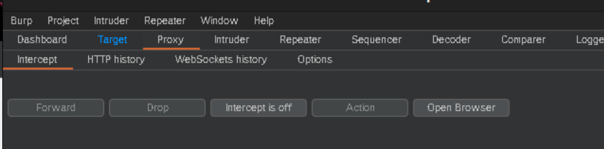

# Day-2 100 DAYS OF BUG BOUNTY CHALLENGE
#### Things to do on DAY-2

# BURPSUIT BASICS

## - Intruder 

- This allows you to perform customized automated attacks, to carry out all kinds of testing tasks.

## - Repeater

- This is used to manually modify and reissue individual HTTP requests over and over.

## - Collaborator Client

- This is used to generate Burp Collaborator payloads and monitor for resulting out-of-band interactions.

## - Sequencer

- This is used to analyze the quality of randomness in an application's session tokens.

## - Decoder

- This lets you transform bits os application data using common encoding and decoding schemes.

## - Comparer

- This is used to perform a visual comparison of bits of application data to find interesting differences.

## - Extender

- enhance Burp's functionality by installing extensions created by the community or even writing your own.

# How to INTERCEPT HTTP WEB REQUEST ?

- Goto your Burp browser or your configured browser (firefox).

- Goto your foxyproxy extension and turn on Burp.

- Now in your Burpsuite goto PROXY > INTERCEPT > INTERCEPT IS ON

- Now goto your browser and open any website.

- Now you can see the intercepted request in your Burpsuite. forword according to it.

- In HTTP history you'll found all the HTTP requests you intercept in past few hours

# THAT'S ALL FOR BASICS TODAY 
